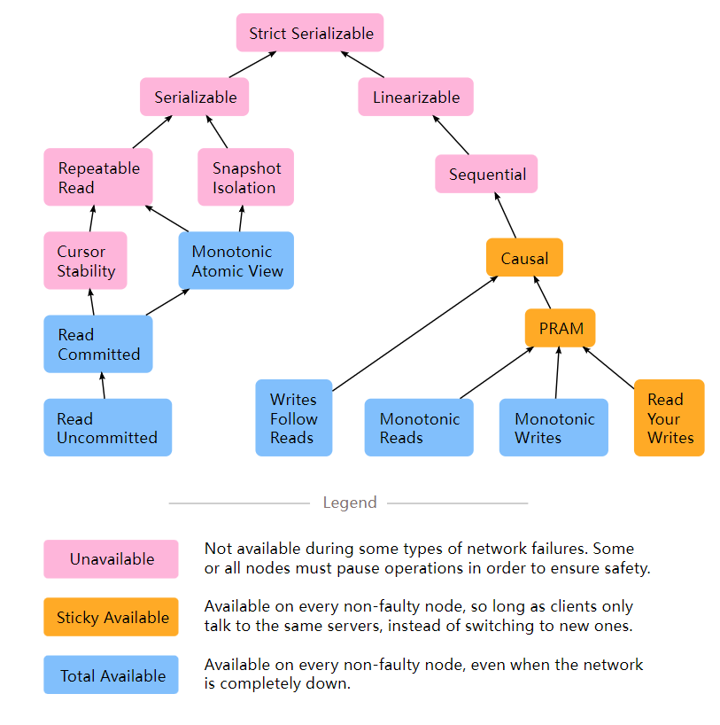

## 因果一致性
# Causal+ consistency

​--因果一致性

背景：地理位置不同的副本设置

多个涉及到跨地域副本的分布式系统

Spanner:

1. 写入会写到全局的Paxos组里,用的是Quorum，也就意味着它的请求要发送到各种数据中心
2. 只读事务是严格串行化的(这是一致性模型里最高的一层)
3. 写请求是如何做到强一致性的？通过2阶段提交把每一个Write都给予一个Tag，这个Tag里包含TrueTime 

Facebook's Memcached

1. 单Master结构,只有Master可以接收写请求
2. 读很快(每台服务器每秒大约有一百万的读请求)

👆上面两个系统的共同点就是它们的读请求都是读本地，但是它们的写却不是写本地的,因此就有了一个疑问，我们能否实现一个系统既能低延迟（Latency）又能高可用（Available）并且Tolerance Partition & Scalable & local Read & local Write(AP),这意味着这个Write到了自己的数据中心commit后之后，直接返回给user,user不需要去等一个跨越整个国家的请求。

在思考上面这个问题前，我们需要想一想像Facebook这样的大型网站，我们需要哪些需求。

1. Availability
2. Low Latency
3. Partition Tolerance(论文中提到Facebook有更好的网络技术，因此网络分区出现的概率很低，这个需求可以不需要那么担心)
4. Scalability *这是非常重要的一点,在不断的加Server上去时该如何保证一致性?如何保证前面的三点

以上4点统称为ALPS,由于CAP理论可知，必须要牺牲一部分来换取另一部分的提高。

## 	一些一致性模型

1. **严格串行化**(要支持事务才能是严格串行化，Total Order + Real - Time)    例子 ： Spanner

2. **强一致性（可串行化）**  例子 ：Paxos，Raft, CRAQ

3. **顺序一致性（Sequential）**(Total Order, Process Ordering,比2要弱一点，丢掉了RealTime的要求),所有的Replica读到的顺序必须是一样的

4. **最终一致性(eventually)**,不同进程的状态在最终会达到一致,允许中间过程不一致(最低级别的一致性)，例子：Amazon's Dynamo  , Facebook's Cassandra(Google  bigTable 的开源实现)    ,  Memcached

   https://stackoverflow.com/questions/29381442/eventual-consistency-vs-strong-eventual-consistency-vs-strong-consistency      票数最高的回答我觉得很nice

对于CAP理论来说1，2，3过于强难以实现最开始的需求，但是4又太弱了,能不能找到一个介于它们之间的一致性，从而实现需求？

## 因果一致性

**因此，本文的主角 因果一致性**（Causal+/Causal  Consistency  Causal+相对于  Causal来说它会转换执行结果,也可以认为Causal+  Consistency = Causal  Consistency + Error Handle）**就诞生了**  

​下图来自`https://jepsen.io/consistency`

最严格的一致性Strict Serializable,由上到下严格性依次递减。

## 什么是因果一致性

首先因果一致性有三个要求，只要两个操作满足下列三个要求，那它们之间就存在因果一致性

1. 定义一个因果关系,使用$a \leadsto b$表示，这意味着b依赖于a,或者说ab之间有因果关系,  如果在一个单线程执行过程中,a happens befor b，这就表示b依赖于a，ab之间有因果关系。在单线程中很容易定义出一个因果关系。
2. 在不同的线程执行过程中如何定义因果关系？ **如果a是一个put**(或者说是写，Write，也就会使目标发生状态改变的操作),**b是一个get**（不会使目标发生变化）,**get操作返回的值是a put进去的，那么我们就说b是依赖于a的**.
3.   传递性 ，三个操作a,b,c 如果 $a \leadsto b$， $b \leadsto c$   那么 $a \leadsto c$

上图可以看成是3个Client并行执行，每一个Client都有自己的执行顺序，但它们之间对同一个数据又有不同的操作,因此它们之间存在着依赖链。

那么在什么情况下它们没有因果一致性呢？那就不符合三个要求里的任意一个就好,比如put(x,3) 和 put(x,4) 我们不能说这两个之间是有因果关系的，因为它们两个有可能是并行发生的，也就意味着我们无法确定先后。

假如a和b两个操作向一个key都发起了put操作，那么它们就会进入到一个冲突状态，因为它们之间没有一个顺序来让服务器知道谁先谁后,作为程序员来说是不希望有冲突的，因为有些冲突可能会让一些副本永远的错误下去。

因此需要有冲突处理机制来解决这个问题

1. 一个通常的处理方式是**Last-Write-Wins**(Thomas Write Rule),我们给每一个Write都加一个时间戳，这个时间戳会告诉我们,该Write是在什么时候发生,如果有两个Write同时进来,那么哪个Write是最后的写,它就会被接受，其他的写就会被丢弃。metadata里包含时间戳
2. 让用户决定，比如说git，git每次用户push的时候，如果有冲突，那么就需要用户自己解决冲突
3. Redis, Riak, Cosmos DB 里使用到的CRDTs(比如Google在线文档，Microsoft   World是如何解决冲突的)机制。 

