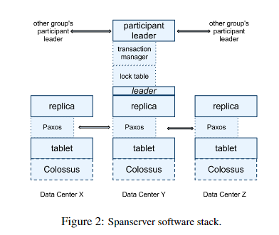

# Spanner

## Spanner 的前世今生

当时Google的数据库系统

- BigTable:缺乏对复杂schema和强一致性的支持 (其实也是有需求才有Spanner)
- Megastore：性能不好

Spanner是一个：高隔离,强一致（能在全球数据中心做到强一致，却又不损失太多可用性，这是如何做到的？）,半结构化的分布式数据库

影响了之后的数据库设计：CockroachDB  (为什么叫蟑螂？我觉得应该是想要这个DB像小强一样顽强，高性能，话说国外也有打不死的小强这个俚语吗？哈哈) CockroachDB是由一群曾经参加过 Google BigTable，Spanner 工作的工程师开发的，所以说其设计受Spanner的影响比较大。

## Spanner 

Spanner论文中的Abstract部分大概提到了它的一些特点，比如说在全球范围能够分布式事务(意味着支持ACID)支持(第一个能够完成如此大规模任务的系统)，外部(external consistent)一致性，高精度时钟(GPS+原子钟)，高性能事务处理(乐观的并发控制)。

Q1:什么样的schema可以认为是复杂的schema？

A1: 相对于BigTable来说，BigTable跟关系型数据库不同，对数据的限制少，比较松散。Spanner 是OLTP的系统。

总结一下Abstract里的特点就是

1. SQL数据库，ACID支持，尤其是对最高隔离级别**可串行化**的支持(serializability)的支持
2. CAP系统:对几乎最高级别一致性----**外部一致性**的支持
3. 水平伸缩性:数据分片并支持分布式事务处理(满足跨Shard的事务处理，序列化和强一致)
4. 高性:只读事务的非阻塞实现(效果：Google的客户F1约99%的只读事务)

## Spanner's Transaction

` Spanner如何在全球范围内完成最严格，最理想化的事务的支持？`

使用的技术是比较成熟的技术

第一个是两阶段提交 2PC

首先两阶段提交是为了解决分布式事务这个问题的， 所谓分布式事务就是说有一个事务，它可能需要修改的东西涉及在不同的节点,在这种情况下需要遵循一定的协议,才能保证这个事务ACID的性质。

2PC工作流程：

第一阶段（Request-to-Prepare和Prepared）(提交请求阶段),在此阶段会选出一个Coordinator(协调者),Coordinator会去问这些参与的节点 "我想要修改你们节点里的这些数据，你们能不能完成？" ,一个比较理想的情况就是所有节点都回复说可以,那么这些资源在后续会被锁起来，以备提交。如果说其中有任何一个参与的节点说 "我做不到",那整个Transaction就要Abort。

第二阶段（Commit，Done)(提交执行阶段)   假如所有的节点都没有问题，那么Coordinator会让它们Commit，它们做完了会回复Coordinator一个Done，那么整个Transaction就结束了。如果万一在这些过程中出现了一些问题，这个Transaction最后都不会被执行，比如说一个节点无论它在第一阶段说不行，还是在第二阶段失败了，那么这整个分布式的Transaction都需要Abort或者Rollback。

一般的分布式事务都会遵循这个协议，但是这个协议对于错误过于敏感(单点故障)。一个非常严重的问题就是，有一个节点在第一阶段承诺可以做这件事，但是在第二阶段它失联了(也就意味着Coordinator即不知道它做没做，也不知道它到底是失败了),这个时候整个系统就陷入一种阻塞的状态。

其它系统针对这个问题的改进方式:

1. 引入超时机制
2. 3PC

**Spanner采取的改进**

Spanner采用了Paxos,通过将几个Replica组成一个Paxos Group,来解决这样的一个单点故障,3 副本可以容忍有一个节点挂掉，然后整个系统仍然能够对外交流。但是它提高了系统的通信开销，以前2PC只需要跟Coordinator通信，但是现在需要让节点之间达成共识，这也算是一种tradeoff吧,用一定的延迟换取了可用性。

## 数据库的隔离级别(ACID)

A:一个事务要么做完，要么回滚，不能出现中间状态

C:在单机版的系统上没有什么特殊含义

I:事务之间并发执行，但不能相互影响

D:事务一旦提交，无论发生什么事情，最后都能恢复过来(WAL)。

Spanner的厉害之处就在于其以**高效的方式实现了很强的隔离级别**。

隔离级别：并发事务的中间结果何时，以何种方式对其它事务可见

好的隔离级别：并发执行的事务得到的结果与串行执行的预期一样.

数据库隔离级别（由低到高）

1. 读未提交   （能读到其它事务未提交的数据,一个但凡正常点的系统都不允许出现这种情况）
2. 读已提交
3. 可重复读   （在同一个事务中读两次，读到的数据是否一致） (但是可重复读会发生幻读，结果条目数量问题)
4. 可序列化  （实现方式     悲观/乐观 并发控制）

**一般情况实现可串行化的方法**      2PL    快照隔离

**两阶段锁 2PL**（悲观并发控制）

两阶段

- 锁增长阶段，第一阶段只能申请锁，不可释放锁
- 锁收缩阶段，第二阶段只能释放锁，不可申请锁

每个事务执行前要先获取锁

- 读操作会阻塞写操作
- 写操作会阻塞读操作
- 写操作会阻塞写操作

那么代价是什么呢？   一旦涉及到锁，那么性能就不会好，因为有东西会被阻塞。

**快照隔离（Snapshot isolation）**（乐观并发控制里有代表性的）

快照隔离的思想就是数据库会保存数据的不同版本

本图来自DDIA

​	可以看到每条数据都有版本号（created by ，deleted by = nil 代表目前没有被删除），一个事务看到的可能是另一个事务在修改之前的版本，所以说它读的不是最新的数据，它读的可以是历史上的版本，也就是所谓的Snapshot。通过这样的方式也完成了事务之间的隔离，有种读写分离的感觉。

​	快照隔离在原始版本上由很多的变种，最朴素的快照隔离其强于可重复读，略弱于可串行化，但稍加改进可达到可串行化。

Spanner的混合并发控制

Spanner将两个乐观与悲观的并发控制方式结合了起来。对于既有读和写的事务里使用悲观的并发控制（2PL），乐观的并发控制只用在只读的事务上。

## Spanner 如何保证一致性

Spanner 遵循严格的时间顺序的强一致性。

要实现强一致，首先需要定义一个顺序，要定义顺序的话，首先需要定义一个版本。

只读事务（RO）的版本是其**开始**的时间

读写事务（RW）的版本是**commit**的时间

首先我们先假设时钟非常的精确（但是这个显然不可能，在分布式系统中，不同节点上的时钟由时间漂移，同步时间的话还会有延迟），我们先假设有这么一个精确的时钟，后面再看Spanner是如何做到的。

不精确的时钟+耐心=精确的时钟

生活中的时钟都是不精确的（大多数系统都是最终一致性）

但是我们认为，等待一段时间后，我们写的数据应该能在所有副本上读到。

**Spanner时钟黑科技，设计真正的亮点**：GPS+原子钟   （这套技术即使开源了，别的公司也不一定能够复现，这套技术需要很强大的全球物理网络作为支撑）

在每一个数据中心里都放了一个原子钟，用全程直连光纤连接各个DC，然后通过GPS来定期校准，这样就能保证每个数据中心的时钟都是精确的。通过这个黑科技Google可以把误差控制在几个ms之内，平均大概4个ms

对于每一个时间戳，都会有一个绝对的置信区间（100%置信）（区间长度若干毫秒）

PS:TrueTime Api 不提供开源。因此在Spanner的开源实现中，选取了稍弱的方式来实现TrueTime
也就是now()方法提供的并不是时间点，而是一个时间段，在这个时刻最早可能是什么，最晚可能是什么，这个范围很小，在17年这个区间跨度为4ms。

读写事务的版本可以是  可提交时刻的latest timestamp，等待该时间确定过去，才会释放锁

只读事务的版本是 开始时刻的latest timestamp

举个栗子

事务T1在commit req阶段已经做完了，但其仍然要wait到它拿到的时间段最后才可以commit done（也就意味着2PL的锁才可以释放）。然后T2才可以开始做，T2之前是由T1的锁挡住了，其后续仍然要重复T1的过程。

以上过程就能一定保证**之后执行的事务的版本号要比之前执行的事务的版本号要高**，从而保证了线性一致性。这对于系统运行的正确性非常重要。

当然，可以看到两个事务都有wait时间，这就是这种方案的代价。但是这种代价远远小于Paxos公式的代价。 

Spanner通过这种方法，能够在不精确的时钟上，依然能够保证是强一致的。此外还能够保证只读的事务不需要锁。

大多数内容来自System meetup学习记录，供复习之用

